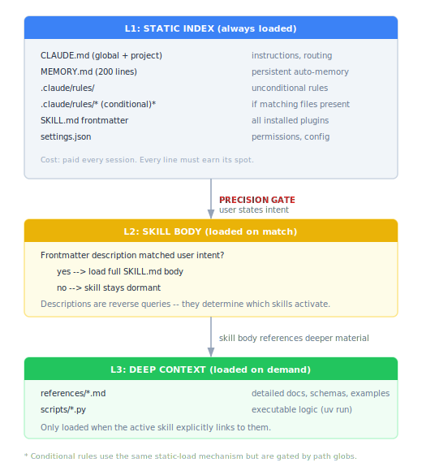

# design principles

Skills are retrieval, and retrieval serves an architecture. This document covers both. First, the architectural worldview: agents are trees, the harness is the system, context isolation matters more than context size, and feedback loops compound. Then, the retrieval system that implements it: precision-gated loading, progressive disclosure, and the principles that govern how skills, rules, and context should be designed, loaded, and maintained.

## the architecture

### trees, not workflows

Linear A-B-C workflows compound context at every handoff. By step six, the model treats everything as one big input -- the condition where things go wrong silently. Earlier steps bleed into later ones, contradictions accumulate, and the model has no mechanism to forget what it shouldn't have seen.

The right topology is a tree. The orchestrator decomposes the problem to its lowest useful granularity, spins up focused subagents, they execute and return results to the orchestrator (not to each other), then disappear. Each subagent sees only its slice. The orchestrator synthesizes. This maps directly to the five invariant operations of selection under constraint: decompose, route, prune, synthesize, verify.

Parallelism heuristic: divide work the way you would for humans. If you can't explain a clean division of labor to a team, you can't explain it to agents either.

### the harness is the system

Model and harness (Claude Code, Codex, Gemini CLI) are a single compound AI system that jointly optimizes. The moat is the harness and everything you don't see -- tool orchestration, context management, permission models, caching, retry logic, output formatting.

External wrappers can't optimize at the level the AI lab can. They break when the harness changes. They can't participate in the co-optimization loop between model and tooling.

Build inside the harness. Guide it with data and structure -- skills, rules, metadata, retrieval indexes. New behavior is new data, not new code.

Corollary: don't be model-agnostic for most use cases. The harness optimizes for specific model capabilities. Model-agnostic design sacrifices the tight coupling that makes the system work.

### context isolation over context accumulation

Each subagent gets only the precise context it needs. Precise beats bloated.

This is the memory hierarchy from early computing applied to attention. Fewer things in context means fewer contradictions, less prompt injection surface, less behavioral corruption.

Context isolation motivates the L1/L2/L3 loading hierarchy in the retrieval section below.

### use it, then prepare it

You don't prepare it first and use it second. You use it, and the using prepares it.

LLMs consume semantically rich data -- PDFs, images, unstructured docs -- more efficiently than ETL pipelines can parse them. Don't perpetually "get ready." A subagent extracts structured data from the raw layout. Another writes tests and validates. A human reviews and corrects. The data is ready when it has been used, tested, and refined -- not when a pipeline declares it clean.

The real investment is not bigger context windows but better indexing, richer metadata, and search that returns the right thing instead of everything.

### structured outputs as state

Store agent outputs as structured data. Relational databases are the right substrate -- queryable, versionable, debuggable. Data people understand them intuitively. LLMs are good at SQL.

Knowledge graphs are seductive but brittle. Updates are impossible without breaking existing edges. Granularity changes invalidate the schema. What looks like flexibility is actually fragility at scale.

This repo uses DuckDB star schemas (agent-state) for exactly this reason: append-only facts, slowly changing dimensions, queryable from any language.

### feedback loops compound

Each iteration of the compound system generates signal -- what gets created, what gets discarded, what succeeds, what fails. That signal feeds the next cycle. Coding agents are getting better because this loop exists.

In this repo: pipeline creates skill, agent uses skill, human reviews, pipeline refines skill. The maintenance system (`/maintain`, quality checks, upstream detection) implements this loop explicitly.

Build the feedback mechanism where users already spend their days. Adoption of new systems is hard. Signal that requires switching tools gets ignored.

## the retrieval problem

An LLM's context window is not memory -- it is attention. Everything loaded into the window competes for the model's attention. Irrelevant context doesn't just waste tokens. It degrades accuracy, causes unintended behavior, and dilutes the signal the model needs to do its job.

The core problem: given a user's intent, retrieve the right context at the right time, and nothing else.

This is precision and recall applied to context:

- **Precision** (of loaded context): what fraction of the context window is relevant to the current task? Low precision means irrelevant context is loaded -- skill overtriggering, bloated SKILL.md files, ambient hooks injecting noise. The consequence is behavioral corruption: the model acts on information it shouldn't have.

- **Recall** (of needed context): does the model have everything it needs? Low recall means the model falls back to training data, which is stale, unversioned, and unauditable. Controlled retrieval via skills is always preferable to hoping the model "knows" something.

**High precision is the constraint. High recall is the goal.** Retrieve as much relevant context as possible without retrieving irrelevant context. The failure modes are asymmetric: low precision causes active harm (wrong behavior), low recall causes passive degradation (generic behavior). Both are bad. Low precision is worse because you can't un-pollute a context window mid-session.

## what gets loaded and when

Three loading levels, each gated by increasing specificity. Analogous to how a search engine works: index -> snippet -> full page.

| Level | What | When | Control |
|-------|------|------|---------|
| **L1** | `~/.claude/CLAUDE.md` (global instructions) | Always | Edit the file |
| **L1** | `./CLAUDE.md` (project instructions) | Always | Edit the file |
| **L1** | `MEMORY.md` (auto-memory, first 200 lines) | Always | Edit the file |
| **L1** | `.claude/rules/general.md` (unconditional rules) | Always | Edit or delete |
| **L1**\* | `.claude/rules/skills.md`, `plugins.md` (conditional rules) | When matching files are in context | Path globs in frontmatter |
| **L1** | All installed SKILL.md frontmatter (~2% of context) | Always | Install/uninstall plugins |
| **L1** | `.claude/settings.json` | Always | Edit the file |
| **L2** | SKILL.md body | Intent matches frontmatter description | Description quality |
| **L3** | `references/*.md` | Skill body links to them | Explicit link in SKILL.md |
| **L3** | `scripts/*.py` | Skill invokes them | `uv run` or subprocess call |

*\* Conditional rules use the same static-load mechanism but are gated by path globs -- they only appear when matching files are in context.*

### loading hierarchy

```
SESSION START
  |
  v
+-----------------------------------------------------------+
| L1: STATIC INDEX (always loaded)                          |
|                                                           |
|   CLAUDE.md (global + project)   instructions, routing    |
|   MEMORY.md (200 lines)          persistent auto-memory   |
|   .claude/rules/                 unconditional rules      |
|   .claude/rules/*  (conditional) if matching files present*|
|   SKILL.md frontmatter           all installed plugins    |
|   settings.json                  permissions, config      |
|                                                           |
|   Cost: paid every session. Every line must earn its spot.|
+-----------------------------------------------------------+
  |
  | user states intent -- PRECISION GATE
  v
+-----------------------------------------------------------+
| L2: SKILL BODY (loaded on match)                          |
|                                                           |
|   Frontmatter description matched user intent?            |
|     yes --> load full SKILL.md body                       |
|     no  --> skill stays dormant                           |
|                                                           |
|   Descriptions are reverse queries -- they determine      |
|   which skills activate.                                  |
+-----------------------------------------------------------+
  |
  | skill body references deeper material
  v
+-----------------------------------------------------------+
| L3: DEEP CONTEXT (loaded on demand)                       |
|                                                           |
|   references/*.md    detailed docs, schemas, examples     |
|   scripts/*.py       executable logic (uv run)            |
|                                                           |
|   Only loaded when the active skill explicitly links to   |
|   them. Maximum recall without polluting other tasks.     |
+-----------------------------------------------------------+
```

Staged retrieval:
- **L1** (static index): always loaded. Tiny, precise. Determines routing.
- **L2** (skill body): loaded on match. Full instructions for the active workflow.
- **L3** (deep context): loaded on demand. References and scripts when needed.



## principles

### 1. optimize for relevant context at the right time

Not minimal context. Not maximal context. **Relevant** context. A complex workflow skill legitimately needs reference material -- but that material should load only when the skill is active, not when it's being considered for activation.

Progressive disclosure is the mechanism: frontmatter is the filter, body is the payload, references are the deep store.

### 2. precision is the constraint, recall is the goal

Every piece of loaded context should be relevant to the current task (precision). Within that constraint, retrieve everything the model needs to avoid falling back to training data (recall).

When in doubt, err on the side of not loading. The user can always ask for more context. They cannot remove context that's already been loaded.

### 3. descriptions are queries in reverse

A skill description is not documentation. It is a **reverse query** -- it describes the set of user intents that should match this skill. The same techniques that make search queries effective make skill descriptions effective: specific terms, explicit scope, negative conditions.

A vague description is a broad query. It matches too much. A precise description with trigger phrases and scope boundaries is a targeted query. It matches what it should and nothing else.

### 4. every always-loaded line must justify its presence

CLAUDE.md, rules, memory, and skill descriptions load on every session. They are the fixed cost of this project. Treat them like a database index: essential for routing, deadly if bloated.

If a rule applies only sometimes, scope it with path globs. If a CLAUDE.md section is only relevant during maintenance, move it to a referenced file. If a skill description is longer than necessary for routing, trim it.

### 5. controlled retrieval over training data

When the model needs domain knowledge, prefer retrieving it from a skill or reference file over relying on training data. Training data is:
- Stale (frozen at a cutoff date)
- Unversioned (you can't diff what the model "knows")
- Unauditable (you can't inspect what it will retrieve from memory)

A skill is versioned, inspectable, updatable, and testable. When you find yourself relying on the model's innate knowledge repeatedly for the same domain, that's a signal to create a skill.

### 6. human feedback closes the loop

Retrieval quality cannot be fully automated. Whether a skill triggered at the right time, whether the loaded context was helpful, whether the result was accurate -- these require human judgment. The maintenance workflow (`/maintain`, test suite, best practices review) keeps a human in the loop for quality decisions that can't be reduced to property checks.

## what this means for this repo

These principles govern everything in fb-claude-skills:

- **Skill authoring**: descriptions are reverse queries (principle 3). Bodies use progressive disclosure (principle 1). Token budgets enforce index hygiene (principle 4).
- **Plugin distribution**: marketplace listing is the catalog. Install/uninstall is the user controlling what's in their always-loaded index (principle 4).
- **Maintenance**: `/maintain` detects when upstream changes affect retrieval quality. The test suite encodes measurable properties. Human review handles the rest (principle 6).
- **Hooks**: must justify their trigger frequency and context injection. Nothing fires ambiently without documented rationale (principles 2 and 4).
- **Rules**: unconditional rules are always-on cost. Conditional (path-scoped) rules are precision-gated retrieval (principle 1).
- **Agent topology**: orchestration uses tree decomposition, not linear handoff chains. Subagents get scoped context and return results to the orchestrator (trees, not workflows).
- **Harness-native design**: all behavior is expressed as data inside the harness -- skills, rules, metadata, hooks. No external wrappers (the harness is the system).
- **State management**: agent outputs stored in relational schemas (DuckDB star schema in agent-state), not flat files or KV stores (structured outputs as state).
- **Compound feedback**: each maintenance cycle generates signal that refines the data driving the next cycle. The loop compounds (feedback loops compound).
