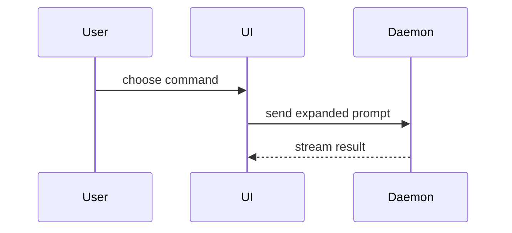

# Show me

The problem this solves is not "the user wants a picture". It is that a
paragraph explaining structure is harder to read than the structure itself, and
agents default to the paragraph.

So: pick the smallest representation that makes the point, put it next to one or
two sentences, and stop. Skip the preamble.

**Text shapes first.** They are lighter and faster than HTML and good enough for
most dev-shaped problems. HTML is the expensive option and earns its place only
when the point is visual, interactive, or too dense for the shapes below.

Use one of these. Occasionally two. Never all of them.

## Pseudocode, for logic and algorithms

```text
on(save)
  if content is unchanged
    return cached result
  write new content
  return fresh result
```

## Call tree, for runtime control flow

```text
submitForm
  createSession
    persistPrompt
    launchAgent
  navigateToSession
```

## Component tree, for UI structure

Keep the state and module boundaries that matter, drop everything else.

```tsx
<SessionPage> (apps/example/src/routes/session.tsx)
  useSessionEvents()
  <SessionToolbar>
    <RunSkillButton> (packages/ui)
```

## File tree, for responsibility and refactor scope

Shallow, one line of responsibility per entry.

```text
src/
├── commands/       # parses user actions
├── sessions/       # owns session state
└── transport/      # sends API requests
```

## Types and signatures, for code that does not exist yet

The shape of the thing before any of it is written: too internal for an
architecture doc, and exactly what an agent gets wrong when left to infer it.
This is the highest-value shape during design.

```ts
interface Item {
  id: ItemId
  parentId: ItemId | null
}

interface Cursor {
  position: ItemId
  direction: 'up' | 'down'
}

resolveTarget(items: Item[], cursor: Cursor): ItemId | null
```

## Mermaid, for interaction and state

Sequence and state diagrams carry the most; reach for them when the point is
ordering or transitions rather than containment.



## Diff, when the shape already exists and only the change matters

Match the diff to the topic. Any shape above can be diffed.

A component change:

```diff
 <SessionPage>
   useSessionEvents()
   <SessionToolbar>
+    <RunSkillButton />
   <SessionTimeline>
+    <SkillResultCard />
```

A file-layout change:

```diff
 src/
 ├── commands/
+│   └── show-me.ts       # expands the slash command
 ├── sessions/
-└── transport.ts
+└── transport/
+    ├── client.ts
+    └── stream.ts
```

A call-tree change:

```diff
 submitForm
   createSession
     persistPrompt
+    expandSkillMention
     launchAgent
   navigateToSession
+    subscribeToEvents
```

A state or control-flow change:

```diff
 on(save)
-  write content
+  if content is unchanged
+    return cached result
+  write new content
+  invalidate cache
```

## Whole block, when most of it is new

Show the full thing when omitting context would hide ownership or order, or when
the user needs a copyable target shape.

```ts
function expandSkill(command: string): string {
  const skillName = command.slice(1)
  return `use the ${skillName} skill`
}
```

## One HTML page, when text genuinely cannot carry it

For a visual UI, a layout, a state comparison, or a concept too dense for
mermaid. Match the product's colors, type, and spacing; use real labels and real
data, never lorem; support desktop and mobile.

Publish it with the `Artifact` tool, which renders mermaid natively and gives
the user a link they can keep. Load the `artifact-design` skill first. Where
Artifact is unavailable, write the file and open it in the default browser:

```
open path/to/show-me-{description}.html      # macOS
xdg-open path/to/show-me-{description}.html  # Linux
```

## Where this pays most

Program design, before implementation. Discussing the types, the signatures, and
the call stacks before an agent writes them is the phase most often skipped, and
the one where a shared shape prevents the most rework.

Reading a large diff is the other. The same shapes work post-hoc to find what
deserves attention.
